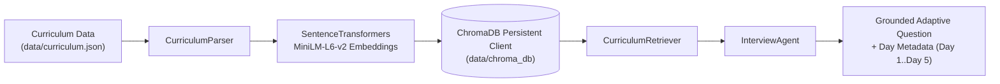

# INTERVUE AI

### Adaptive Technical Interview Agent


> **Hackathon Core Directive**: *"Build the interviewer, not the interview."*

**Intervue AI** is a state-of-the-art adaptive technical interviewer system. It evaluates candidates' technical depth using an adaptive policy planner, answer scoring engine, curriculum vector search (ChromaDB RAG), candidate profile personalization, and live LLM model inference (Qwen3 via Ollama) paired with deterministic rule-based fallbacks.

---

## 🚀 Live Demo & Repository

- **GitHub Repository**: [https://github.com/Vivek-Maheshwari-07/intervue-ai](https://github.com/Vivek-Maheshwari-07/intervue-ai)
- **Deployment Status**: Production-ready for Vercel (Frontend) and Render (FastAPI Backend + ChromaDB).

---

## 🤖 AI Usage Log

- **Prompt Engineering & Agent Iteration Log**: [PROMPTS.md](./PROMPTS.md)

---

## 💥 The Problem

Traditional technical interview preparation and automated screeners suffer from severe structural flaws:

1. **Static & Generic**: Ask pre-scripted questions regardless of candidate responses or experience level.
2. **No Adaptive Depth**: Cannot increase difficulty when candidates show mastery or provide step-backed clarification when gaps appear.
3. **Un-grounded Knowledge**: Generic LLM interview bots hallucinate irrelevant topics outside the target engineering curriculum.
4. **Lack of Personalization**: Treat senior data engineers and junior frontend developers identically.
5. **Shallow Feedback**: Provide binary pass/fail grades instead of actionable engineering feedback mapping back to specific curriculum units.

---

## 💡 The Solution

**Intervue AI** transforms technical screening into a dynamic, curriculum-grounded dialogue through a 7-stage state machine pipeline:

```
┌───────────────────────────┐
│     Candidate Profile     │  Personalization (Job Role & Skip History)
└────────────┬──────────────┘
             ▼
┌───────────────────────────┐
│   Curriculum Context RAG  │  ChromaDB + SentenceTransformers MiniLM
└────────────┬──────────────┘
             ▼
┌───────────────────────────┐
│  Adaptive Question Planner│  Policy Engine (HARDER, CLARIFY, NEW_TOPIC, MODERATE)
└────────────┬──────────────┘
             ▼
┌───────────────────────────┐
│    Technical Interview    │  Interactive React 19 UI (Anti-Paste Protected)
└────────────┬──────────────┘
             ▼
┌───────────────────────────┐
│     Answer Evaluation     │  LLM Scoring / Concept Extraction Engine
└────────────┬──────────────┘
             ▼
┌───────────────────────────┐
│   Session Persistence     │  SQLite Multi-Turn State Sync (aiosqlite)
└────────────┬──────────────┘
             ▼
┌───────────────────────────┐
│  Final Feedback Synthesis │  Strengths, Gaps, and Curriculum Next Steps
└───────────────────────────┘
```

---

## ⭐ Key Features

### 🧠 Adaptive Questioning Policy
Questions dynamically adjust in real time based on candidate answers rather than following a rigid script.

### 📚 Curriculum-Grounded RAG (ChromaDB)
Retrieves semantic context from `data/curriculum.json` using `sentence-transformers/all-MiniLM-L6-v2` vector embeddings to keep questions authoritative and relevant.

### 👤 Candidate Personalization
Inspects candidate job roles, experience years, and mission history from `data/candidates.json` to select tailored starting topics and priority curriculum areas.

### 🎯 Curriculum Day & Topic Tracking
Propagates `"day"` metadata (`Day 1: Fundamentals`, `Day 2: System Design`, `Day 3: Databases`, `Day 4: Reliability`) into session state to enforce broad curriculum coverage.

### 🔒 Code-Enforced Interview Completion Rules
Hardcoded completion guard guarantees thorough assessment:
$$\text{question\_count} \ge 8 \quad \text{AND} \quad \text{unique covered curriculum units} \ge 4$$

### ⚡ Deterministic Answer-Differentiated Fallback
Runs 100% offline without Ollama or paid cloud APIs if needed. Extracts technical concepts (`Redis`, `PostgreSQL`, `LRU Cache`, `Kafka`, `Docker`) from previous candidate answers to generate context-aware follow-ups.

### 📝 Actionable Feedback Synthesis
Generates structured candidate reports containing overall score averages, technical strengths, knowledge gaps, and specific curriculum review recommendations.

### 🔄 Multi-Turn Stateful Persistence
Uses SQLite (`backend/interview_sessions.db`) to preserve complete session state across multiple HTTP requests.

---

## ⭐ Why Intervue AI?

| Feature | Generic LLM Chatbots | Intervue AI |
| :--- | :--- | :--- |
| **Question Flow** | Linear / Random | **Adaptive Policy Engine** |
| **Grounding** | Unconstrained Prompting | **ChromaDB Curriculum RAG** |
| **Candidate Context** | None | **Personalized Candidate Profiles** |
| **State Persistence** | Memory / Ephemeral | **SQLite Multi-Turn Session Database** |
| **Offline Reliability** | Fails without API | **Dynamic Concept-Driven Fallback** |
| **Completion Guarantee** | Arbitrary Stop | **Enforced (>=8 Questions & >=4 Days)** |

---

## ⚙️ How the Adaptive Interview Works

The `QuestionPlanner` policy engine inspects candidate answer scores and current topic saturation to emit four distinct adaptive signals:

1. 🚀 **`ACTION_HARDER`**: Emitted on strong scores ($\ge 7.5/10$). Increases architectural depth, traffic scale requirements, and edge-case complexity.
2. 💡 **`ACTION_CLARIFY`**: Emitted on knowledge gaps ($\le 4.5/10$). Steps back to fundamental mechanisms to evaluate core understanding.
3. 🔄 **`ACTION_NEW_TOPIC`**: Emitted when current topic question quota is met. Seamlessly transitions candidate to an un-covered curriculum topic and day.
4. 🎯 **`ACTION_MODERATE`**: Emitted on solid intermediate answers ($5.0 - 7.0/10$). Probes performance, memory, and complexity trade-offs.

---

## 🔎 RAG Pipeline Architecture



1. **Ingestion**: `CurriculumParser` reads structured 5-day curriculum modules (`data/curriculum.json`).
2. **Embedding**: Generates 384-dimensional dense vector embeddings using `all-MiniLM-L6-v2`.
3. **Vector Storage**: Persists collections locally using `chromadb.PersistentClient`.
4. **Retrieval**: `CurriculumRetriever` queries top-$k$ semantic matches per topic while extracting `"day"` metadata.
5. **State Tracking**: `InterviewAgent` appends retrieved curriculum days into `state.covered_days`.

---

## 🏗️ System Architecture

```
                    ┌─────────────────────────┐
                    │  React 19 Frontend UI   │
                    │  (Vite 6 + Tailwind v4) │
                    └────────────┬────────────┘
                                 │
                                 ▼
                     POST /api/interview (Tech Spec)
                                 │
                    ┌────────────┴────────────┐
                    │    FastAPI Backend      │
                    │   (backend/main.py)     │
                    └────────────┬────────────┘
                                 │
                                 ▼
                    ┌─────────────────────────┐
                    │     InterviewAgent      │
                    │ (Single Source of Truth)│
                    └────────────┬────────────┘
                                 │
            ┌────────────────────┼────────────────────┐
            ▼                    ▼                    ▼
     QuestionPlanner     AnswerEvaluator       Ollama Qwen3 /
      Policy Engine        Scoring Engine     Offline Fallback
            │                    │
            └──────────┬─────────┘
                       ▼
             Curriculum Retriever
                       │
                       ▼
             ChromaDB Vector Store
                       │
                       ▼
             SQLite Session Database
```

---

## 🛠️ Tech Stack & Author Attribution

### Technologies Used
- **Frontend**: React 19, Vite 6, TailwindCSS v4, Lucide React, Chart.js.
- **Backend**: Python 3.13, FastAPI 0.115, Uvicorn, Pydantic v2, `aiosqlite`.
- **RAG & Vector Search**: ChromaDB, `sentence-transformers` (`all-MiniLM-L6-v2`).
- **AI Model / LLM**: Ollama (`qwen3:8b`), custom rule-based concept extractor fallback.

### Authors & Team Responsibilities
- **Vivek Maheshwari** — Agent Orchestration, Planner Engine, Evaluator & LLM Client Integration (*Person 1*)
- **Aayush Malhotra** — Curriculum RAG Ingestion, ChromaDB Vector Store & Retriever (*Person 2*)
- **Manav Lathiya** — FastAPI Backend, SQLite Session Persistence & React Frontend UX (*Person 3*)

---

## 💻 Local Development Setup

### Single-Command Start (Frontend + Backend + Ollama Check)
```bash
npm run dev
```

This single command launches:
1. **Frontend**: React UI at `http://localhost:5173`
2. **Backend**: FastAPI server at `http://localhost:8000` (Health Probe: `http://localhost:8000/health`)
3. **Ollama Check**: Verifies local Ollama service at `http://localhost:11434`

---

## 🧪 Verification & Testing

### 1. Run Complete Pytest Suite (35 Tests)
```bash
python -m pytest backend/tests tests/test_retrieval.py tests/test_adaptive_e2e_scenarios.py
```

### 2. Run Interactive E2E Verification Script
```bash
python tests/test_adaptive_interview.py
```

### 3. Verify Production Frontend Build
```bash
npm run build
```

---

## 📄 API Contract Specification

### 1. Session Start (`POST /api/interview`)
**Request Payload:**
```json
{
  "sessionId": "session-demo-101",
  "candidate": {
    "id": "person-3",
    "name": "Aayush Malhotra"
  }
}
```

**Response Payload:**
```json
{
  "reply": "Let's now transition to Data Structures & Algorithmic Efficiency. How do you approach designing robust solutions for this domain in production?",
  "done": false,
  "sessionId": "session-demo-101"
}
```

### 2. Ongoing Adaptive Turn (`POST /api/interview`)
**Request Payload:**
```json
{
  "sessionId": "session-demo-101",
  "message": "I built a RAG architecture using OpenAI embeddings and ChromaDB vector store for semantic document retrieval."
}
```

**Response Payload:**
```json
{
  "reply": "Regarding your points on chromadb, what are the specific performance, complexity, and memory consumption trade-offs in your approach?",
  "done": false,
  "sessionId": "session-demo-101"
}
```

### 3. Session Completion (`POST /api/interview`)
**Response Payload when `question_count >= 8` AND `covered_days >= 4`:**
```json
{
  "reply": "Technical interview completed.",
  "done": true,
  "feedback": {
    "summary": "Candidate demonstrated strong skills across System Architecture and Databases.",
    "strengths": [
      "Completed all technical interview questions",
      "Solid competency in System Architecture"
    ],
    "gaps": [
      "Needs improvement in distributed locking edge cases"
    ],
    "next": [
      "Review specific curriculum modules for identified gaps.",
      "Conduct a follow-up targeted technical session."
    ]
  }
}
```

---

## 🌐 Production Deployment Architecture

To host **Intervue AI** publicly for judges at zero cost (₹0):

1. **Frontend (Vercel)**: Import repository into Vercel and configure `VITE_API_URL` pointing to your Render backend API (e.g. `https://intervue-ai-backend.onrender.com`).
2. **Backend (Render)**: Deploy as a Python Web Service using `render.yaml`:
   - **Build Command**: `pip install -r backend/requirements.txt`
   - **Start Command**: `uvicorn backend.main:app --host 0.0.0.0 --port $PORT`
   - **Environment Variables**:
     - `CORS_ORIGINS`: `https://your-app.vercel.app,*`
     - `OLLAMA_BASE_URL`: Set to a public remote GPU Ollama URL (e.g., via Ngrok tunnel `https://xxxx.ngrok-free.app` or Modal GPU host).
     - *Note*: Since Render containers cannot connect to your local PC's `localhost:11434`, if `OLLAMA_BASE_URL` is omitted or unreachable, the system automatically uses its built-in deterministic fallback engine with zero downtime.

